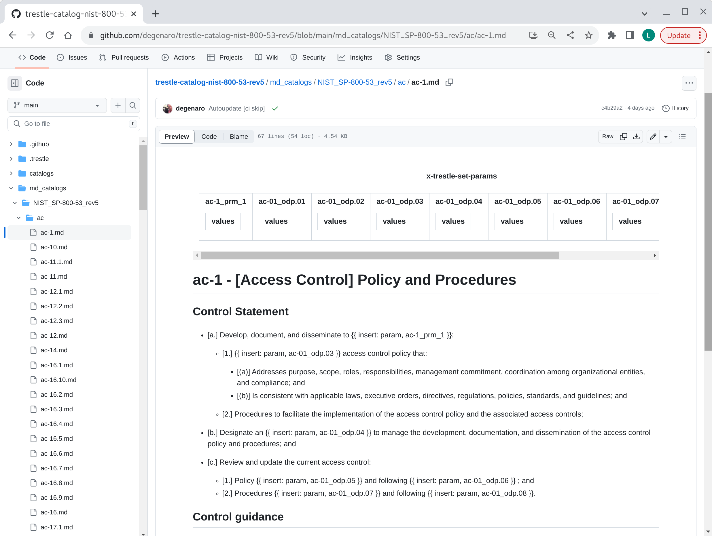
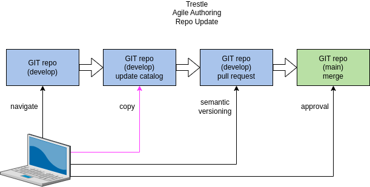
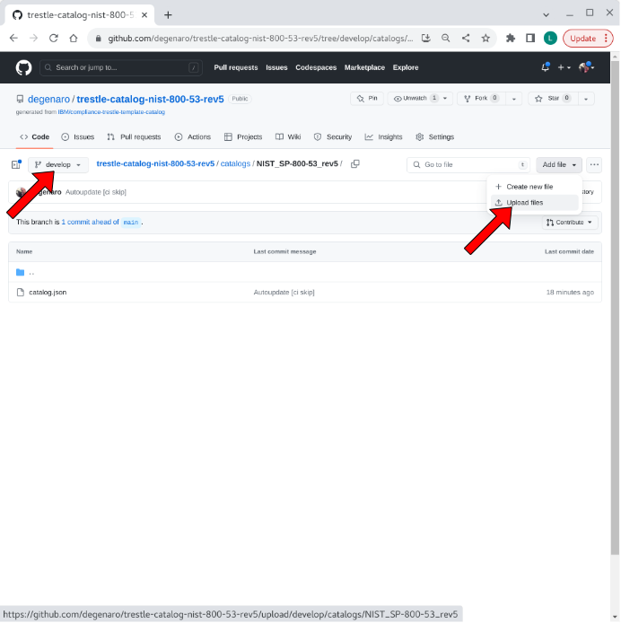
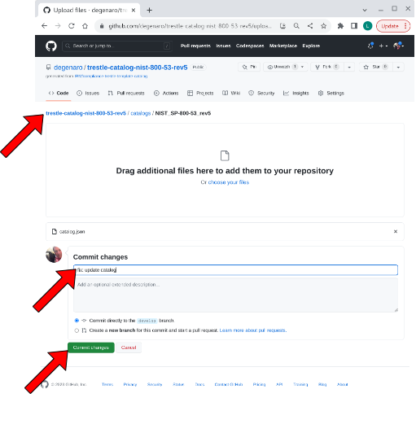
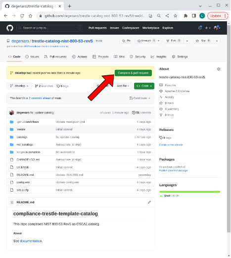
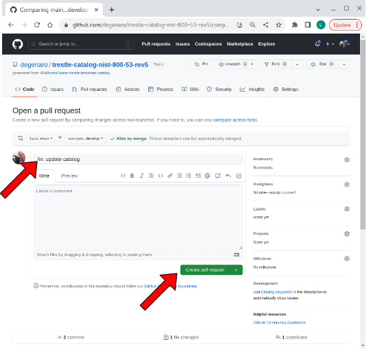
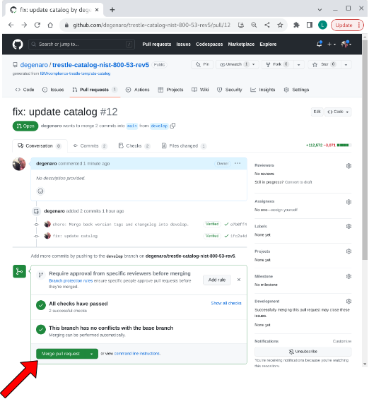

## compliance-trestle-catalog

compliance-trestle repository for agile authoring of catalog

Prerequisite: [catalog template](https://github.com/IBM/compliance-trestle-template-catalog) has been used to create catalog repo for [agile authoring](https://github.com/IBM/compliance-trestle-agile-authoring).

- [view catalog markdown](#view-catalog-markdown)
- [update catalog](#update-catalog)

-----

##### view catalog markdown

Navigate to the `md_catalogs` folder, then descend to the control of interest.

visual

-----

##### update catalog

The BSI upstream catalog is watched daily by [`.github/workflows/upstream-catalog-watch.yml`](.github/workflows/upstream-catalog-watch.yml). When [`upstream.env`](upstream.env) points at a changed resolved catalog, automation opens or updates a PR to `develop` with the new `catalogs/grundschutz-plus-plus/catalog.json`. After merge, the develop push workflow regenerates `md_catalogs/`. Manual sync below remains a fallback; you can also run the workflow via **Actions → Upstream catalog watch → Run workflow**.

Steps to modify the catalog repository with an updated catalog are given below:

###### 1. navigate to develop branch location of catalog in repo.

visual

###### 2. copy updated catalog to repo.

visual

###### 3. compare & pull request

visual

###### 4. create pull request

visual

###### 5. merge pull request

visual

###### 6. confirm merge

visual

-----

##### references

- [documentation: agile authoring](https://github.com/IBM/compliance-trestle-agile-authoring#compliance-trestle-agile-authoring)

______________________________________________________________________

We are a Cloud Native Computing Foundation sandbox project.

<picture>
  <source media="(prefers-color-scheme: dark)" srcset="https://www.cncf.io/wp-content/uploads/2022/07/cncf-white-logo.svg">
  
</picture>

The Linux Foundation® (TLF) has registered trademarks and uses trademarks. For a list of TLF trademarks, see [Trademark Usage](https://www.linuxfoundation.org/legal/trademark-usage).

*OSCAL Compass is an independent open source project. It is not affiliated with, endorsed by, or sponsored by the National Institute of Standards and Technology (NIST) or any other government agency.*

*OSCAL Compass was originally contributed by IBM.*
